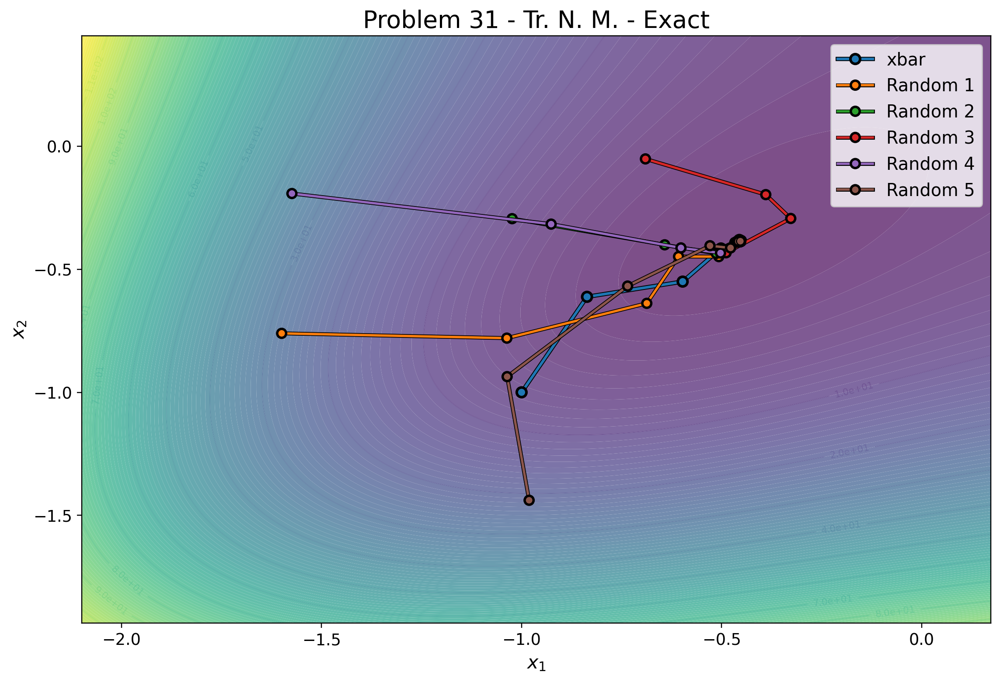
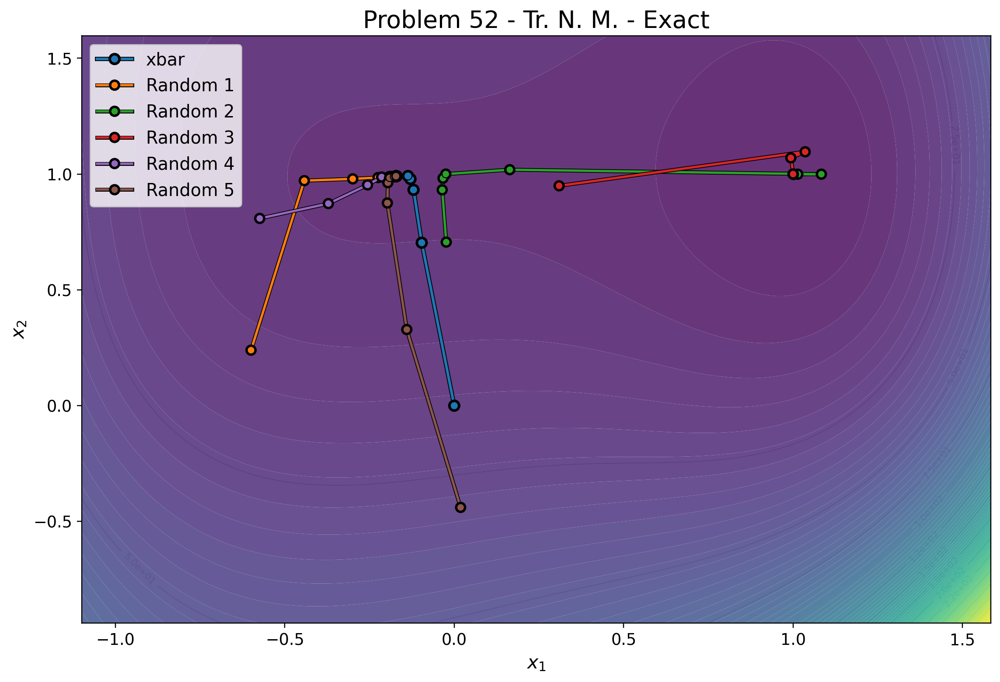

# Unconstrained Derivative-based Optimization

**Politecnico di Torino** *Course: Numerical Optimization for Large Scale Problems (A.Y. 2025/2026)*

## Project Description
This project implements and analyzes algorithms for unconstrained derivative-based numerical optimization, focusing specifically on solving large-scale problems. The scripts evaluate the mathematical performance of various methods and approximation techniques, comparing key metrics such as the number of iterations, execution times, and success rates.

## Implemented Algorithms
The algorithmic core of the scripts focuses on the following methodologies:

* **Optimization Methods:**
    * **Modified Newton Method:** Optimization via modified Cholesky factorization to guarantee safe descent directions even with non-positive definite matrices.
    * **Truncated Newton Method (Inexact Newton):** Approximate resolution of the linear system to scale efficiently on large problems.
* **Finite Differences Approximation:**
    * Gradient and Jacobian approximation (focusing on diagonals for memory efficiency).
    * Hessian approximation (pentadiagonal structure) computed via finite differences of the gradient.
    * Dynamic management and stability study as the *step size* ($h$) varies.
* **Test Models (Benchmarks):**
    * **Problem 31:** Broyden problem.
    * **Problem 52:** Trigonometric exponential system.

## Results and Visualizations
Comprehensive performance results, detailed metrics, and further analyses are thoroughly documented in the project report `NumOptReport2526_ChaouiAziz_Egidio_Paoletti.pdf` included in this repository.

Below are two visual examples illustrating the 2D convergence paths of the Truncated Newton method applied to the benchmark problems.

### Broyden Problem (Problem 31)
2D convergence of the Truncated Newton method on the Broyden problem:

### Trigonometric Exponential System (Problem 52)
2D convergence of the Truncated Newton method on the Trigonometric exponential system:

---

## Authors
* **Chaoui Aziz Riym**
* **Egidio Elio**
* **Paoletti Simone**